Automated monitoring reveals diverse effects of abiotic and biotic factors on behavioral dominance in Andean Hummingbirds
========================================================

MS submitted in the 
Ben G. Weinstein, corresponding author, email: bweinste@life.bio.sunsysb.edu

Department of Ecology and Evolution, Stony Brook University, Stony Brook, New York 11794; USA
Catherine H. Graham, email: Catherine.Graham@stonybrook.edu

Department of Ecology and Evolution, Stony Brook University, Stony Brook, New York 11794; USA
Contributions: BW, CG developed the conceptual ideas for the MS; BW collected data, BW conducted the analyses; CG and BW wrote the MS

********

Introduction
-------------

Competition between species may limit local diversity by excluding competitors with similar niche requirements. In addition, it may promote regional diversity, where checkerboard patterns of ecological similar species replace each other across a microclimatic gradient (gottelli and graves). Competition for resources can result in direct interference encounters between species, or exploitation of a common and limited resource. Fundamental tenets of community ecology suggest that closely related, morphologically similar, and aggressive species should compete vigorously for local resources. Where species compete for limited resources species adapted to similar niche requirements will cause local extinctions in subordinate competitors. However, differences in behavior, foraging strategies, and micro-scale distribution allows co-occurrence through fine scale niche diversification

Optimal foraging theory posits that species should feed on most profitable resource available, where an organism evaluates the time needed to extract the resource, versus the value of the resource. Unequal competitive ability among species will lead to reduced visitation to high value patches through interspecific competition. We contrast, abiotic, and biotic predictors of competition through behavioral dominance. Decreased access to high value resources may lead to negative fitness consequences, given the extreme metabolic pressures of hummingbird flight. We offer three, non-exclusive hypothesis, 1) Species should be most selective at the center of their range. Following the abundance center hypothesis, we expect the highest quality territory at the center of species elevation range. Individuals in non-suitable habitat, or weakly suitable habitat, may be inferior competitions due to mal-adaptation to the environment. 2) Species should be most selective when they are the largest (most massive) bird in the competitive community, 3) Species should be most selective when there are many available resources at that elevation.

Hummingbirds are highly specialized nectivorous feeders with adapted morphologies for extracting nectar from hummingbird pollinated flowers. Differences in foraging strategies have important ramifications for species metabolic rate, resource acquisition and mortality (cite). Hummingbird foraging ecology has been extensively studied (Camfield, 2006; P. A. Cotton, 1983; P. a. Cotton, 2006; Feinsinger & Colwell, 1978; González-Gómez, Vásquez, & Bozinovic, 2011; D. R. Powers & Conley, 1994; D. Powers, 1987), and hummingbirds are often partitioned into different syndromes based on their resource use, interspecific aggression and morphology. Feinsinger (1978) partitioned hummingbirds into six ecological roles: marauder, high-reward trapliner, filcher, generalist, territorialist, low-reward trapliner. While these categories are not absolute, and may change over time and space (Feinsinger & Colwell, 1978), they provide an overview for the spectrum of behaviors and associated morphologies, which can be used to categorize hummingbirds in an assemblage. Using these ecological roles, early studies evaluated eco-morphological connections between specific biomechanical flight measures (wing-disc loading, body mass, thrust) and interspecific dominance. For example, wing-disc loading (WDL) is the ratio of mass to wing span, and is a measure of hummingbird agility and thrust (but see Altshuler et al., 2002). Feinsinger and Colwell (1978) predicted that territorial individuals will have high WDL values, which gave them an advantage in flight performance. However, recent work has reexamined the relationship between wing-disc loading and territoriality, and did not support the earlier finding when incorporating phylogenetic interdependence (D. L. Altshuler, 2004). While it is clear that ecological roles are related to morphology (Figure 3), this relationship needs to refined and experimentally tested, especially in a phylogenetic context.

******
Methods
=========
Study Site
-----------
Data was collected at the Maquipicuna Research Station and Santa Lucia Ecolodge (0.11838,-78.61205) between June and August 2013 along an elevation gradient of 1300-2600m. This elevation contains of regenerating secondary and primary cloud-forest, an ecotype dominated by cool year round temperatures, and pronounced  precipitation seasonality, with a warmer dry season (June-Sep) and a cooler rainy season (Jan – May) (Webster and Rhodes 2001). 
Selectivity Experiments
Every 200m of elevation, we placed a feeder with a high value resource (1.2M sucrose), and a low value resource (0.30M sucrose). Feeders were filled and opened for 3 days before filming. The feeders were cleaned, and the nectar was replenished every other day. For each species, selectivity will be measured by dividing the time spent feeding on the high value resource by the total feeding time (D. L. Altshuler, 2004; Pimm, Rosenzweig, & Mitchell, 1985; Sandlin, 2000). We removed selectivity events from very rare visitors to feeders ( > than 1min feeding from 6 hour) 

Time-lapse Cameras
--------------------
We used a novel monitoring technique using time lapse video cameras.  Time lapse cameras (Plotwatcher PRO – Day 6) recorded an image every second, beginning at 6am – 12pm, and 12:30pm to 6pm. Cameras were set at each feeder for a minimum of four days. Comparative analysis with high definition cameras, as well as observer counts showed high fidelity and accuracy in bird identification and timing. Frames were given unique IDs based on date and elevation and stored on terabyte hard-drives until review. Utilizing computer vision libraries in python, we developed motion sensing algorithms to return frames with motion from background frames (OpenCV2 see Appendix A).  Comparative tests with an observer watching an entire video showed no difference between occurrence and species identification. Our pipeline returned the top 10% motion frames within the video, which were then scored by the author and assistant. We recorded all visits to a feeder where we visually could recover the bird actively feeding and noted the duration of feeding, rounded to the nearest 1 second.

Morphological Data
-------------------
For trait information, we used measurements of six traits in adult males: body mass, closed wing-length (i.e., wing chord), and length of exposed culmen, tarsus length, nail length, and wing loading (Graham et al. 2012, Appendix B). We choose these traits from a larger 17 trait datasat because they have a stronger biological basis, and are not highly correlated (Appendix B). Body mass is related to thermoregulatory adaptations to high elevation habitats, as well as aggressive interactions among territorial species (Altshuler and Dudley 2002, González-Gómez et al. 2011). Wing chord is a component of hovering flight, which becomes more difficult at high elevation due to lower air density (Feinsinger and Chaplin 1975). Bill length is associated with resource use through matching between bill lengths and corolla lengths in hummingbird pollinated plants (Temeles et al. 2002). We used principle components analysis on the standardized trait matrix to determine the axis of most variation among species in our assemblage. 

Resource Availability and Use
-----------------------------
To measure available resources we counted the number of hummingbird pollinated plants along six 1km transects along the elevation gradient. Each transect was placed to cover ~200m of elevation change along trails in primary and selectively logged forest. Hummingbird flowering plants were identified by direct observation or by using the well-established morphological syndromes following Backer (1973). For each plant, we estimated the number of total flowers by taking the average flowers on 3-5 stalks, and multiplying by the total number of stalks on a plant. Surveys were repeated twice a month. Flowers were identified using the extensive plant list established for the site, as well as consulting with a number of taxonomic experts (see acknowledgements). Surveys were repeated X times for each elevations over three months.

Hummingbirds Occurrence
--------------------------
To avoid circularity with the selectivity at the feeders, we estimated hummingbird range distribution from independent line transects along the elevation gradient. Observers walked at a slow and consistent pace along the 1km flower transects, only stopping to identify hummingbird species. Where hummingbirds were seen feeding on flowers, we noted the plant species, height and behavior (feeding, defending, piercing, etc.) The maximum and minimum elevation for each hummingbird species were used as the range limits along the elevation gradient. 

**********


**What does the data look like?**

<!-- html table generated in R 3.0.1 by xtable 1.7-1 package -->
<!-- Wed Feb 26 11:51:11 2014 -->
<TABLE border=1>
<TR> <TH>  </TH> <TH> Video </TH> <TH> Date </TH> <TH> Replicate </TH> <TH> Elevation </TH> <TH> Treatment </TH> <TH> Species </TH> <TH> Sex </TH> <TH> Time.Begin </TH> <TH> Time.End </TH> <TH> Comment </TH> <TH> Temp </TH> <TH> Perching </TH>  </TR>
  <TR> <TD align="right"> 1 </TD> <TD> 130610AB </TD> <TD> 6/10/2013 </TD> <TD> O </TD> <TD align="right"> 1300 </TD> <TD> L </TD> <TD> White-whiskered Hermit </TD> <TD>  </TD> <TD> 14:13:41 </TD> <TD> 14:13:42 </TD> <TD>  </TD> <TD align="right">  68 </TD> <TD>  </TD> </TR>
  <TR> <TD align="right"> 2 </TD> <TD> 130610AB </TD> <TD> 6/10/2013 </TD> <TD> O </TD> <TD align="right"> 1300 </TD> <TD> L </TD> <TD> White-whiskered Hermit </TD> <TD>  </TD> <TD> 14:13:52 </TD> <TD> 14:14:05 </TD> <TD>  </TD> <TD align="right">  67 </TD> <TD>  </TD> </TR>
  <TR> <TD align="right"> 3 </TD> <TD> 130610AB </TD> <TD> 6/10/2013 </TD> <TD> O </TD> <TD align="right"> 1300 </TD> <TD> L </TD> <TD> White-whiskered Hermit </TD> <TD>  </TD> <TD> 14:15:16 </TD> <TD> 14:15:17 </TD> <TD>  </TD> <TD align="right">  68 </TD> <TD>  </TD> </TR>
  <TR> <TD align="right"> 4 </TD> <TD> 130610AB </TD> <TD> 6/10/2013 </TD> <TD> O </TD> <TD align="right"> 1300 </TD> <TD> L </TD> <TD> Tawny-bellied Hermit </TD> <TD>  </TD> <TD> 14:17:09 </TD> <TD> 14:17:12 </TD> <TD>  </TD> <TD align="right">  68 </TD> <TD>  </TD> </TR>
  <TR> <TD align="right"> 5 </TD> <TD> 130610AB </TD> <TD> 6/10/2013 </TD> <TD> O </TD> <TD align="right"> 1300 </TD> <TD> L </TD> <TD> White-whiskered Hermit </TD> <TD>  </TD> <TD> 14:21:31 </TD> <TD> 14:22:00 </TD> <TD>  </TD> <TD align="right">  68 </TD> <TD>  </TD> </TR>
  <TR> <TD align="right"> 6 </TD> <TD> 130610AB </TD> <TD> 6/10/2013 </TD> <TD> O </TD> <TD align="right"> 1300 </TD> <TD> L </TD> <TD> White-whiskered Hermit </TD> <TD>  </TD> <TD> 14:27:54 </TD> <TD> 14:27:55 </TD> <TD>  </TD> <TD align="right">  68 </TD> <TD>  </TD> </TR>
   </TABLE>


There are 'r nrows(dat)'rows in the dataset.

**Descriptive Statistics**
===================

How many videos have we reviewed for each date and elevation?
<!-- html table generated in R 3.0.1 by xtable 1.7-1 package -->
<!-- Wed Feb 26 11:51:11 2014 -->
<TABLE border=1>
<TR> <TH>  </TH> <TH> Elevation </TH> <TH> Date </TH> <TH> Replicate(O_R) </TH> <TH> High Feeder </TH> <TH> Low Feeder </TH>  </TR>
  <TR> <TD align="right"> 1 </TD> <TD align="right"> 1300 </TD> <TD> 6/10/2013 </TD> <TD> O </TD> <TD align="right">   1 </TD> <TD align="right">   1 </TD> </TR>
  <TR> <TD align="right"> 2 </TD> <TD align="right"> 1300 </TD> <TD> 6/11/2013 </TD> <TD> O </TD> <TD align="right">   2 </TD> <TD align="right">   2 </TD> </TR>
  <TR> <TD align="right"> 3 </TD> <TD align="right"> 1300 </TD> <TD> 6/12/2013 </TD> <TD> O </TD> <TD align="right">   2 </TD> <TD align="right">   3 </TD> </TR>
  <TR> <TD align="right"> 4 </TD> <TD align="right"> 1300 </TD> <TD> 6/13/2013 </TD> <TD> O </TD> <TD align="right">   1 </TD> <TD align="right">   1 </TD> </TR>
  <TR> <TD align="right"> 5 </TD> <TD align="right"> 1500 </TD> <TD> 6/10/2013 </TD> <TD> O </TD> <TD align="right">   1 </TD> <TD align="right">   1 </TD> </TR>
  <TR> <TD align="right"> 6 </TD> <TD align="right"> 1500 </TD> <TD> 6/12/2013 </TD> <TD> O </TD> <TD align="right">   1 </TD> <TD align="right">   1 </TD> </TR>
  <TR> <TD align="right"> 7 </TD> <TD align="right"> 1500 </TD> <TD> 7/14/2013 </TD> <TD> O </TD> <TD align="right">   1 </TD> <TD align="right">   1 </TD> </TR>
  <TR> <TD align="right"> 8 </TD> <TD align="right"> 1700 </TD> <TD> 6/11/2013 </TD> <TD> O </TD> <TD align="right">   1 </TD> <TD align="right">   1 </TD> </TR>
  <TR> <TD align="right"> 9 </TD> <TD align="right"> 1700 </TD> <TD> 6/12/2013 </TD> <TD> O </TD> <TD align="right">   2 </TD> <TD align="right">   2 </TD> </TR>
  <TR> <TD align="right"> 10 </TD> <TD align="right"> 1700 </TD> <TD> 7/16/2013 </TD> <TD> O </TD> <TD align="right">   1 </TD> <TD align="right">   1 </TD> </TR>
  <TR> <TD align="right"> 11 </TD> <TD align="right"> 1700 </TD> <TD> 7/18/2013 </TD> <TD> R </TD> <TD align="right">   1 </TD> <TD align="right">   1 </TD> </TR>
  <TR> <TD align="right"> 12 </TD> <TD align="right"> 1900 </TD> <TD> 6/26/2013 </TD> <TD> O </TD> <TD align="right">   2 </TD> <TD align="right">   1 </TD> </TR>
  <TR> <TD align="right"> 13 </TD> <TD align="right"> 1900 </TD> <TD> 7/1/2013 </TD> <TD> R </TD> <TD align="right">   2 </TD> <TD align="right">   2 </TD> </TR>
  <TR> <TD align="right"> 14 </TD> <TD align="right"> 1900 </TD> <TD> 7/2/2013 </TD> <TD> R </TD> <TD align="right">   2 </TD> <TD align="right">   2 </TD> </TR>
  <TR> <TD align="right"> 15 </TD> <TD align="right"> 1900 </TD> <TD> 8/10/2013 </TD> <TD> R </TD> <TD align="right">   1 </TD> <TD align="right">   1 </TD> </TR>
  <TR> <TD align="right"> 16 </TD> <TD align="right"> 1900 </TD> <TD> 8/7/2013 </TD> <TD> O </TD> <TD align="right">   1 </TD> <TD align="right">  </TD> </TR>
  <TR> <TD align="right"> 17 </TD> <TD align="right"> 2100 </TD> <TD> 6/30/2013 </TD> <TD> O </TD> <TD align="right">   1 </TD> <TD align="right">  </TD> </TR>
  <TR> <TD align="right"> 18 </TD> <TD align="right"> 2100 </TD> <TD> 7/1/2013 </TD> <TD> O </TD> <TD align="right">   1 </TD> <TD align="right">   1 </TD> </TR>
  <TR> <TD align="right"> 19 </TD> <TD align="right"> 2100 </TD> <TD> 8/6/2013 </TD> <TD> O </TD> <TD align="right">   1 </TD> <TD align="right">   1 </TD> </TR>
  <TR> <TD align="right"> 20 </TD> <TD align="right"> 2100 </TD> <TD> 8/8/2013 </TD> <TD> R </TD> <TD align="right">   1 </TD> <TD align="right">   1 </TD> </TR>
  <TR> <TD align="right"> 21 </TD> <TD align="right"> 2300 </TD> <TD> 6/27/2013 </TD> <TD> O </TD> <TD align="right">   1 </TD> <TD align="right">   1 </TD> </TR>
  <TR> <TD align="right"> 22 </TD> <TD align="right"> 2300 </TD> <TD> 6/29/2013 </TD> <TD> O </TD> <TD align="right">   1 </TD> <TD align="right">   1 </TD> </TR>
  <TR> <TD align="right"> 23 </TD> <TD align="right"> 2300 </TD> <TD> 8/10/2013 </TD> <TD> R </TD> <TD align="right">   1 </TD> <TD align="right">   1 </TD> </TR>
  <TR> <TD align="right"> 24 </TD> <TD align="right"> 2300 </TD> <TD> 8/6/2013 </TD> <TD> O </TD> <TD align="right">   1 </TD> <TD align="right">   2 </TD> </TR>
  <TR> <TD align="right"> 25 </TD> <TD align="right"> 2500 </TD> <TD> 6/27/2013 </TD> <TD> O </TD> <TD align="right">   2 </TD> <TD align="right">   2 </TD> </TR>
  <TR> <TD align="right"> 26 </TD> <TD align="right"> 2500 </TD> <TD> 6/29/2013 </TD> <TD> O </TD> <TD align="right">   1 </TD> <TD align="right">   1 </TD> </TR>
   </TABLE>

Table 1. Number of days of video analyzed for each elevation. For each elevation two sets of high and low value feeders were placed (O or R). The number of videos for each feeder that have been scored for hummingbird selectivity are shown for both the high and low value feeders. 


Figure 1. Elevation range for all species at the feeders

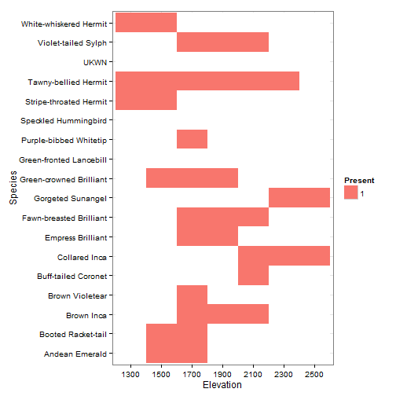 


Figure 2. Total minutes on feeders for each species.

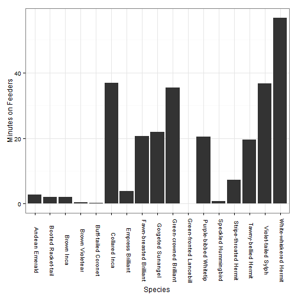 


Figure 3. Average duration of feeding event for each species

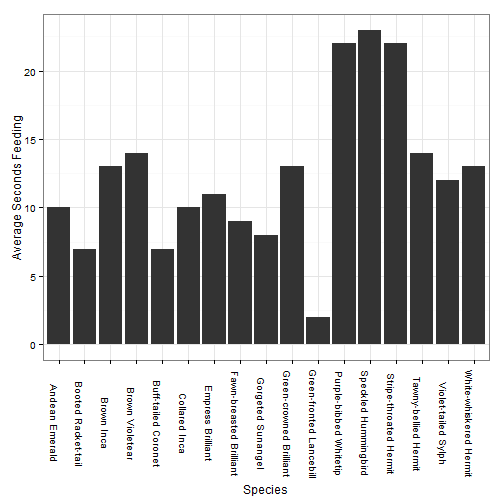 


Figure 4. Average time feeding for all species

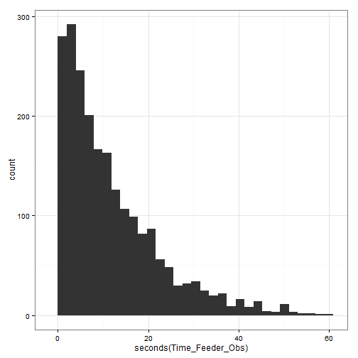 

```
## [1] 142
```


*Compute for each trial, the number of seconds feeding, the selectivity for each species, time between feeding bouts, total number of feeding seconds.*

<!-- html table generated in R 3.0.1 by xtable 1.7-1 package -->
<!-- Wed Feb 26 11:51:15 2014 -->
<TABLE border=1>
<TR> <TH>  </TH> <TH> Species </TH> <TH> Time_High </TH> <TH> Time_Low </TH> <TH> Selectivity </TH> <TH> bph </TH> <TH> avgF </TH> <TH> Elevation </TH> <TH> Date </TH> <TH> Replicate </TH> <TH> Richness </TH> <TH> Tvisits </TH> <TH> Total_Time </TH> <TH> Minutes_High </TH> <TH> Minutes_Low </TH> <TH> Minutes_Total </TH> <TH> MonthA </TH>  </TR>
  <TR> <TD align="right"> 1 </TD> <TD> Tawny-bellied Hermit </TD> <TD align="right"> 0.00 </TD> <TD align="right"> 0.00 </TD> <TD align="right"> 0.83 </TD> <TD align="right"> 7.50 </TD> <TD align="right"> 9.00 </TD> <TD align="right"> 1300 </TD> <TD> 6/10/2013 </TD> <TD> O </TD> <TD align="right">   2 </TD> <TD align="right">  67 </TD> <TD align="right"> 0.00 </TD> <TD align="right"> 3.40 </TD> <TD align="right"> 0.72 </TD> <TD align="right"> 4.12 </TD> <TD> Jun </TD> </TR>
  <TR> <TD align="right"> 2 </TD> <TD> White-whiskered Hermit </TD> <TD align="right"> 0.00 </TD> <TD align="right"> 0.00 </TD> <TD align="right"> 0.62 </TD> <TD align="right"> 9.25 </TD> <TD align="right"> 9.00 </TD> <TD align="right"> 1300 </TD> <TD> 6/10/2013 </TD> <TD> O </TD> <TD align="right">   2 </TD> <TD align="right">  67 </TD> <TD align="right"> 0.00 </TD> <TD align="right"> 3.40 </TD> <TD align="right"> 2.12 </TD> <TD align="right"> 5.52 </TD> <TD> Jun </TD> </TR>
  <TR> <TD align="right"> 3 </TD> <TD> Fawn-breasted Brilliant </TD> <TD align="right"> 0.00 </TD> <TD align="right"> 0.00 </TD> <TD align="right"> 1.00 </TD> <TD align="right"> 2.00 </TD> <TD align="right"> 15.00 </TD> <TD align="right"> 1500 </TD> <TD> 6/10/2013 </TD> <TD> O </TD> <TD align="right">   3 </TD> <TD align="right">  47 </TD> <TD align="right"> 0.00 </TD> <TD align="right"> 1.97 </TD> <TD align="right"> 0.00 </TD> <TD align="right"> 1.97 </TD> <TD> Jun </TD> </TR>
  <TR> <TD align="right"> 5 </TD> <TD> White-whiskered Hermit </TD> <TD align="right"> 0.00 </TD> <TD align="right"> 0.00 </TD> <TD align="right"> 0.41 </TD> <TD align="right"> 9.25 </TD> <TD align="right"> 19.00 </TD> <TD align="right"> 1500 </TD> <TD> 6/10/2013 </TD> <TD> O </TD> <TD align="right">   3 </TD> <TD align="right">  47 </TD> <TD align="right"> 0.01 </TD> <TD align="right"> 4.98 </TD> <TD align="right"> 7.03 </TD> <TD align="right"> 12.02 </TD> <TD> Jun </TD> </TR>
  <TR> <TD align="right"> 6 </TD> <TD> Tawny-bellied Hermit </TD> <TD align="right"> 0.01 </TD> <TD align="right"> 0.00 </TD> <TD align="right"> 0.93 </TD> <TD align="right"> 6.38 </TD> <TD align="right"> 16.00 </TD> <TD align="right"> 1300 </TD> <TD> 6/11/2013 </TD> <TD> O </TD> <TD align="right">   2 </TD> <TD align="right"> 148 </TD> <TD align="right"> 0.01 </TD> <TD align="right"> 12.60 </TD> <TD align="right"> 1.02 </TD> <TD align="right"> 13.62 </TD> <TD> Jun </TD> </TR>
  <TR> <TD align="right"> 7 </TD> <TD> White-whiskered Hermit </TD> <TD align="right"> 0.01 </TD> <TD align="right"> 0.00 </TD> <TD align="right"> 0.83 </TD> <TD align="right"> 12.12 </TD> <TD align="right"> 15.00 </TD> <TD align="right"> 1300 </TD> <TD> 6/11/2013 </TD> <TD> O </TD> <TD align="right">   2 </TD> <TD align="right"> 148 </TD> <TD align="right"> 0.02 </TD> <TD align="right"> 19.75 </TD> <TD align="right"> 4.08 </TD> <TD align="right"> 23.83 </TD> <TD> Jun </TD> </TR>
   </TABLE>


***********

Optimal Foraging
===========

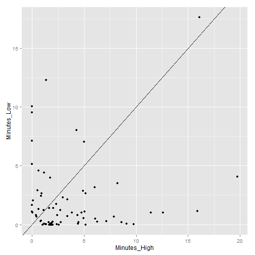 

```
## [1] 1.797
```

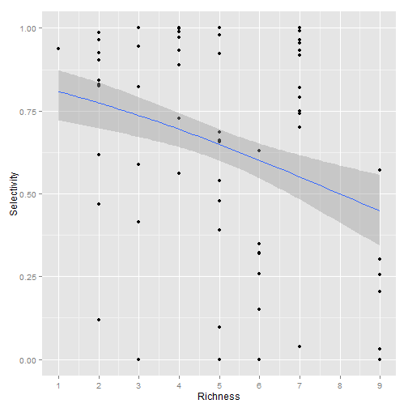 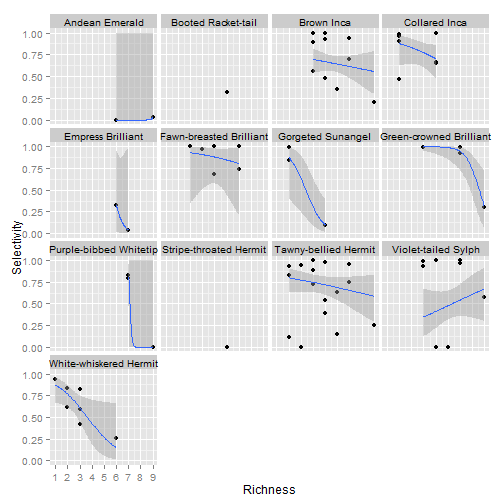 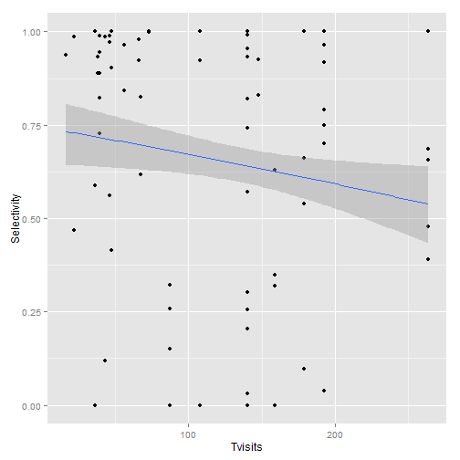 


#Correlations among data
------------------------


```
## Error: could not find function "ggpairs"
```

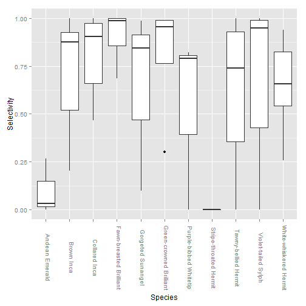 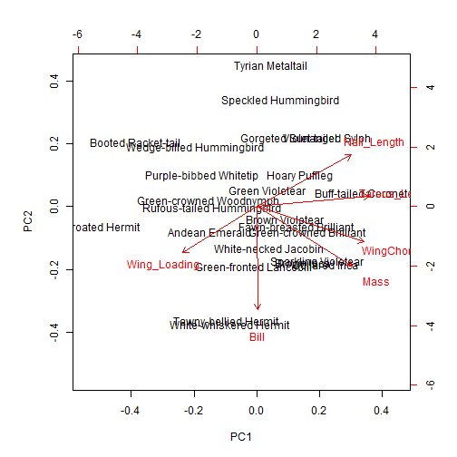 


Hypothesis 1:
------------
Species should be most selective at the center of their range. Following the abundance center hypothesis, we expect the highest quality territory at the center of species elevation range. Individuals in non-suitable habitat, or weakly suitable habitat, may be inferior competitions due to mal-adaptation to the environment.

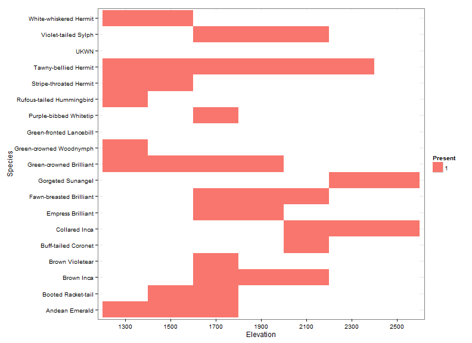 


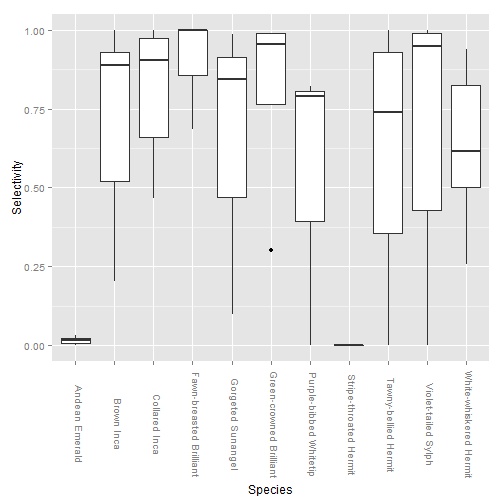  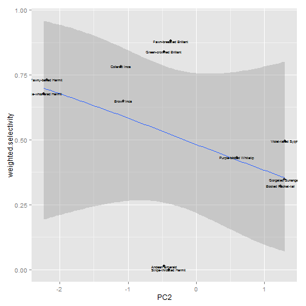 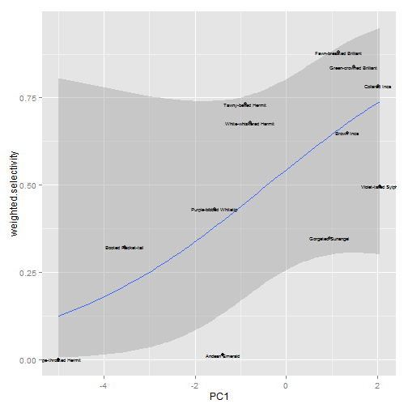 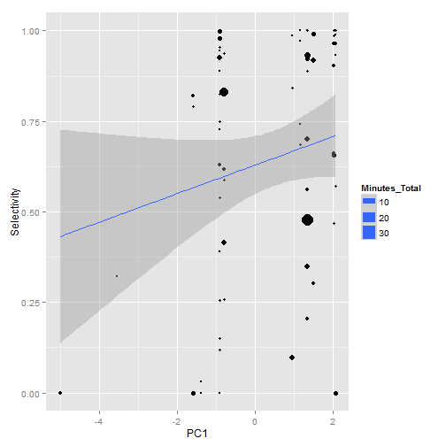 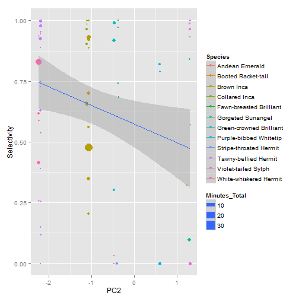 

```
##   GPS.ID ID     Hummingbird.Species     Date_F Month Transect_R
## 1     11  0 Green-crowned Woodnymph 2013-06-04     6  1300_1500
## 2    113  1    White-necked Jacobin 2013-06-06     6  1300_1500
## 3    114  1  White-whiskered Hermit 2013-06-06     6  1300_1500
## 4    115  1        Booted Racketail 2013-06-06     6  1300_1500
## 5    116  2    White-necked Jacobin 2013-06-06     6  1500_1700
## 6    117  2  Purple-bibbed Whitetip 2013-06-06     6  1500_1700
##        Iplant_Double    lat    lon  ele
## 1 Palicourea_demissa     NA     NA 1400
## 2 Palicourea_demissa 0.1182 -78.64 1350
## 3 Palicourea_demissa 0.1178 -78.64 1380
## 4 Palicourea_demissa 0.1148 -78.63 1420
## 5 Palicourea_demissa 0.1071 -78.63 1470
## 6 Palicourea_demissa 0.1064 -78.63 1640
```

```
## [1] 305  10
```

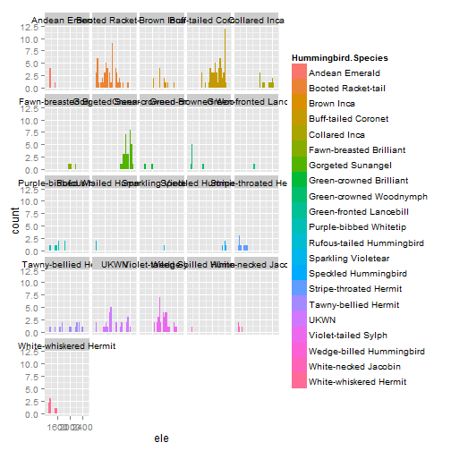 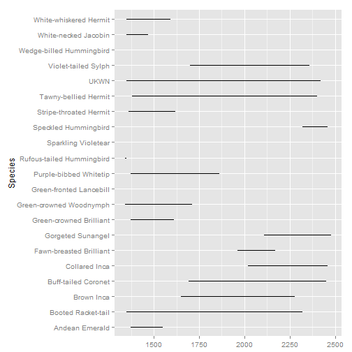 

```
##      Video      Date Replicate Elevation Treatment                Species
## 1 130610AB 6/10/2013         O      1300         L White-whiskered Hermit
## 2 130610AB 6/10/2013         O      1300         L White-whiskered Hermit
## 3 130610AB 6/10/2013         O      1300         L White-whiskered Hermit
## 4 130610AB 6/10/2013         O      1300         L   Tawny-bellied Hermit
## 5 130610AB 6/10/2013         O      1300         L White-whiskered Hermit
## 6 130610AB 6/10/2013         O      1300         L White-whiskered Hermit
##   Sex Time.Begin Time.End Comment Temp Perching Time_Feeder_Obs
## 1       14:13:41 14:13:42           68                 00:00:01
## 2       14:13:52 14:14:05           67                 00:00:13
## 3       14:15:16 14:15:17           68                 00:00:01
## 4       14:17:09 14:17:12           68                 00:00:03
## 5       14:21:31 14:22:00           68                 00:00:29
## 6       14:27:54 14:27:55           68                 00:00:01
```

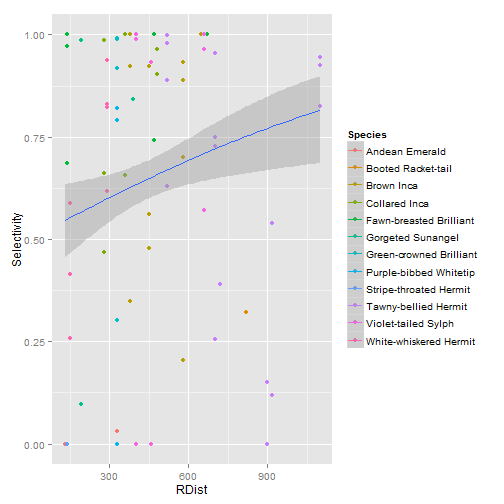 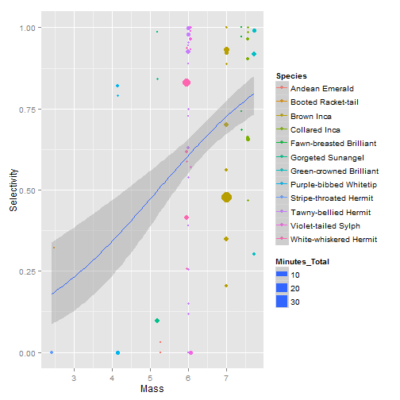 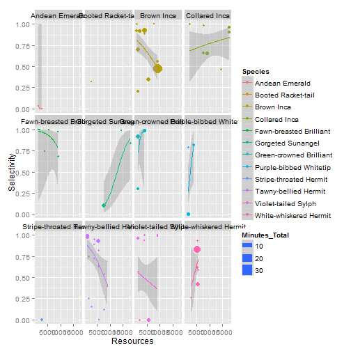 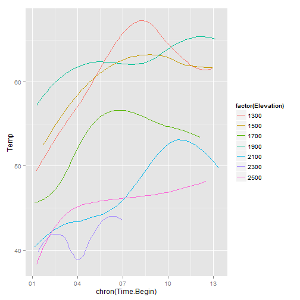 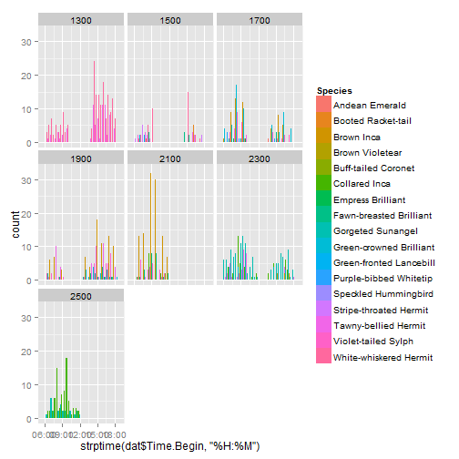 

```
## Error: cairo error 'error while writing to output stream'
```

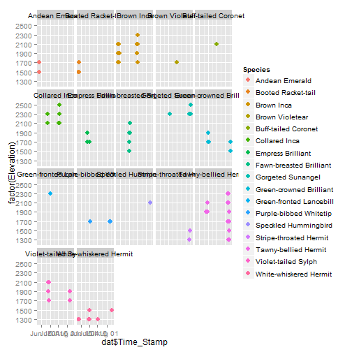 

```
## Error: cairo error 'error while writing to output stream'
```

